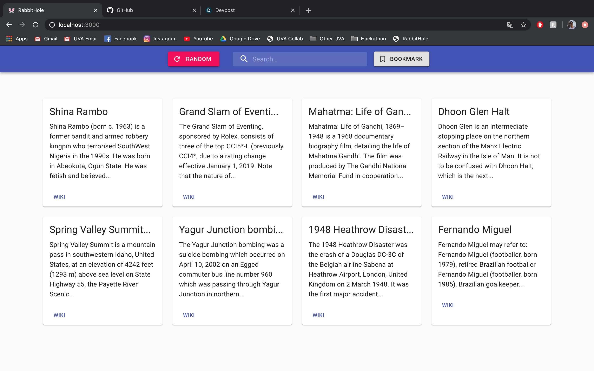

# RabbitHole
Get lost in Wikipedia rabbit holes with RabbitHole.

Check out my video demo by clicking on this image:

## Inspiration

My internship this summer is in React.JS, so I wanted to throw together a simple and visually appealing web application to learn some basic concepts! I love wasting my time down rabbit holes browsing through Wikipedia articles, and I wanted to build a nice UI to accompany that process!

## What it does

RabbitHole populates cards with information and descriptions about related Wikipedia articles. A user can click on any of these cards, and the app will open up the Wikipedia article about that card. You can also search for a topic if you're interested in something specific. I also wrote up a Bookmarklet feature, so that if you're already on Wikipedia, you can open up RabbitHole with cards about that page that you're already looking at.

## How I built it

I used React.JS components to build the application, with a backend of simple Wikipedia API calls. I used a Material UI library for formatting and templating, and wrote up the Bookmarklet feature in super easy JavaScript code.

## Challenges I ran into

I had a lot of trouble with the idea of React re-rendering on state changes. I would change the state of my application and expect the app to reload, but often it wouldn't, or it would complain that I had an undefined value in my state. I finally realized that state updates are asynchronous, which made developing a lot more complicated.

## Accomplishments that I'm proud of

I went into this project with absolutely zero experience in React, and I was able to finish up a functioning application with multiple components! I also have little experience in front end in general, so I was able to brush up on concepts like statefulness and API interactions.

## What I learned

The most valuable thing I learned from this project was passing down information between components in React after each component individually renders. This project really showed me the beauty of React, in that only parts that get new data have to reload, making applications much more quick and enjoyable to use.

## What's next for RabbitHole

I really wanted to implement a trending feature, where I could store searches that people make on RabbitHole and show users the most popular articles being viewed right now. Also, I was planning on writing up code to let users see their "bread crumbs", and see the rabbit holes they've been down in their current session.

# Setup

This project was bootstrapped with [Create React App](https://github.com/facebook/create-react-app).

## Available Scripts

In the project directory, you can run:

### `npm start`

Runs the app in the development mode. 
Open [http://localhost:3000](http://localhost:3000) to view it in the browser.

The page will reload if you make edits. 
You will also see any lint errors in the console.

### `npm test`

Launches the test runner in the interactive watch mode. 
See the section about [running tests](https://facebook.github.io/create-react-app/docs/running-tests) for more information.

### `npm run build`

Builds the app for production to the `build` folder. 
It correctly bundles React in production mode and optimizes the build for the best performance.

The build is minified and the filenames include the hashes. 
Your app is ready to be deployed!

See the section about [deployment](https://facebook.github.io/create-react-app/docs/deployment) for more information.

### `npm run eject`

**Note: this is a one-way operation. Once you `eject`, you can’t go back!**

If you aren’t satisfied with the build tool and configuration choices, you can `eject` at any time. This command will remove the single build dependency from your project.

Instead, it will copy all the configuration files and the transitive dependencies (webpack, Babel, ESLint, etc) right into your project so you have full control over them. All of the commands except `eject` will still work, but they will point to the copied scripts so you can tweak them. At this point you’re on your own.

You don’t have to ever use `eject`. The curated feature set is suitable for small and middle deployments, and you shouldn’t feel obligated to use this feature. However we understand that this tool wouldn’t be useful if you couldn’t customize it when you are ready for it.

## Learn More

You can learn more in the [Create React App documentation](https://facebook.github.io/create-react-app/docs/getting-started).

To learn React, check out the [React documentation](https://reactjs.org/).

### Code Splitting

This section has moved here: https://facebook.github.io/create-react-app/docs/code-splitting

### Analyzing the Bundle Size

This section has moved here: https://facebook.github.io/create-react-app/docs/analyzing-the-bundle-size

### Making a Progressive Web App

This section has moved here: https://facebook.github.io/create-react-app/docs/making-a-progressive-web-app

### Advanced Configuration

This section has moved here: https://facebook.github.io/create-react-app/docs/advanced-configuration

### Deployment

This section has moved here: https://facebook.github.io/create-react-app/docs/deployment

### `npm run build` fails to minify

This section has moved here: https://facebook.github.io/create-react-app/docs/troubleshooting#npm-run-build-fails-to-minify
